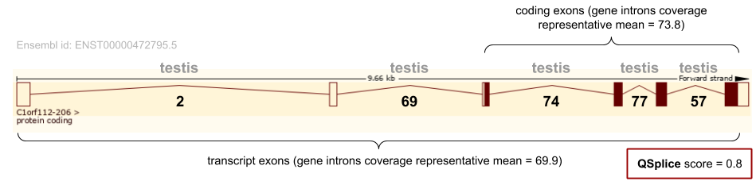

# QSplice

Quantifying splice junctions coverage from SJ.out.tab released by STAR mapping it to genome positions. 

The Snakemake workflow stored in [gitlab.com/fpozoc/appris_rnaseq](https://gitlab.com/fpozoc/appris_rnaseq) offers a simple pipeline to generate the splice junctions samples used by `QSplice` to quantify the transcript expression.

### Table of Contents

**[Installation Instructions](#installation-instructions)**<br>
**[Usage](#usage)**<br>
**[Example: Chromosome 1 open reading frame 112 (C1orf112)](#example-chromosome-1-open-reading-frame-112-c1orf112)**<br>
**[Author information and license](#author-information-and-license)**<br>
**[Release History](#release-history)**<br>
**[Contributing](#contributing)**<br>
**[License](#license)**

## Installation Instructions

Run the silent installation of Miniconda in case you don't have this software in your Linux Environment

```sh
wget https://repo.anaconda.com/miniconda/Miniconda3-latest-Linux-x86_64.sh
bash Miniconda3-latest-Linux-x86_64.sh -b -p $HOME/miniconda3
```

Once you have installed Miniconda/Anaconda, create a Python environment. Clone this repository and install inside your recently created conda environment.

```sh
conda create --name qsplice python=3.7
conda activate qsplice

git clone https://gitlab.com/fpozoc/qsplice.git
cd qsplice
pip install .
```

[genometools](https://github.com/genometools/genometools) must be installed in the OS.

```sh
apt-get install genometools
```

## Usage

This package has been implemented for [GENCODE](https://www.gencodegenes.org/human/) and [RefSeq](https://ftp.ncbi.nlm.nih.gov/refseq/) genome annotation versions.
User has to specify the desired version typing `g` or `r` + version number, e.g. `g27`.

First, user has to generate introns the genome annotation with `intronator.py` from the reference genome annotation file in gff format.

```sh
python -m qsplice.intronator --version g27 --file gencode.v27.annotation.gff3.gz
```

To map splice junctions previously generated (see STAR) and calculate `QSplice` scores per transcript run `map_junctions.py`.
 
 For instance, the output generated by the pipeline [gitlab.com/fpozoc/appris_rnaseq](https://gitlab.com/fpozoc/appris_rnaseq) is stored in this way:
 `out/E-E-MTAB-XXXX/GRCh38_GENCODE/STAR/g27` + `experiment_number` + `SJ.out.tab`.

User has to add as arguments the version id (again) and the directory with the experiments to be globbed.

```sh
python -m qsplice.map_junctions --version g27 --globdir out/E-MTAB-XXXX/GRCh38_GENCODE/STAR/g27
```

However, if user wants to add a previously customized (and annotated) file:

```sh
python -m qsplice.map_junctions --version g27 --custom --file out/E-MTAB-XXXX/GRCh38_GENCODE/STAR/g27/SJ.out.tab.concat.gz
```

## Example: Chromosome 1 open reading frame 112 (C1orf112)

[ENSG00000000460](https://www.ensembl.org/Homo_sapiens/Gene/Summary?g=ENSG00000000460;r=1:169662007-169854080) (Ensembl) - [Q9NSG2 (CA112_HUMAN)](https://www.uniprot.org/uniprot/Q9NSG2) (UniProt)

`qsplice.emtab2836.g27.tsv.gz` sample output for some isoforms of [ENSG00000000460](https://www.ensembl.org/Homo_sapiens/Gene/Summary?g=ENSG00000000460;r=1:169662007-169854080). 

|gene_name|transcript_id  |intron_number|start    |end      |nexons|ncds|unique_reads|tissue       |gene_mean|gene_mean_cds|RNA2sj|RNA2sj_cds|
|---------|---------------|-------------|---------|---------|------|----|------------|-------------|---------|-------------|------|----------|
|C1orf112 |ENST00000286031|6            |169804241|169806003|24    |22  |53          |testis       |69.6     |73.8         |0.8   |0.7       |
|C1orf112 |ENST00000359326|7            |169804241|169806003|25    |22  |53          |testis       |69.6     |73.8         |0.8   |0.7       |
|C1orf112 |ENST00000413811|20           |169849605|169850264|23    |14  |62          |testis       |69.6     |73.8         |0.9   |0.8       |
|C1orf112 |ENST00000459772|2            |169798959|169802620|23    |3   |7           |fallopiantube|69.6     |73.8         |0.1   |0.1       |
|C1orf112 |ENST00000466580|2            |169798959|169802620|8     |3   |7           |fallopiantube|69.6     |73.8         |0.1   |0.1       |
|C1orf112 |ENST00000472795|5            |169803310|169804074|6     |4   |57          |testis       |69.6     |73.8         |0.8   |0.8       |

`sj_maxp.emtab2836.g27.mapped.tsv.gz` sample output for the isoform [ENST00000472795](https://www.ensembl.org/Homo_sapiens/Transcript/Summary?db=core;g=ENSG00000000460;r=1:169662007-169854080;t=ENST00000472795).

In this case, the method selects the splice junction number 5, located between 169803310 and 169804074. This splice junction has the maximum coverage value in testis with 57 unique reads spanning the junction. It is the lowest coverage per isoform, if we only take into account introns that has been spanned by coding exons. The final score `RNA2sj` and `RNA2sj_cds` are obtained dividing this score by its respective gene mean.

|gene_name|transcript_id  |intron_number|start    |end      |nexons|ncds|unique_reads|tissue|gene_mean|gene_mean_cds|RNA2sj|RNA2sj_cds|
|---------|---------------|-------------|---------|---------|------|----|------------|------|---------|-------------|------|----------|
|C1orf112 |ENST00000472795|1            |169794906|169798856|6     |4   |2           |testis|69.6     |73.8         |0.0   |0.0       |
|C1orf112 |ENST00000472795|2            |169798959|169800882|6     |4   |69          |testis|69.6     |73.8         |1.0   |0.0       |
|C1orf112 |ENST00000472795|3            |169800972|169802620|6     |4   |74          |testis|69.6     |73.8         |1.1   |1.0       |
|C1orf112 |ENST00000472795|4            |169802726|169803168|6     |4   |77          |testis|69.6     |73.8         |1.1   |1.0       |
|C1orf112 |ENST00000472795|5            |169803310|169804074|6     |4   |57          |testis|69.6     |73.8         |0.8   |0.8       |

<div align="center">
  <br>
</div>

## Reference files

```sh
$ head -n 3 SJ.out.tab

chr1    14830   14969   2       2       0       0       3       44
chr1    15039   15795   2       2       1       1       9       40
chr1    15948   16606   2       2       1       0       11      47
```

From [STAR manual](http://labshare.cshl.edu/shares/gingeraslab/www-data/dobin/STAR/STAR.posix/doc/STARmanual.pdf) documentation:

```sh
SJ.out.tab contains high confidence collapsed splice junctions in tab-delimited format. The columns
have the following meaning:
column 1: chromosome
column 2: first base of the intron (1-based)
column 3: last base of the intron (1-based)
column 4: strand (0: undefined, 1: +, 2: -)
column 5: intron motif: 0: non-canonical; 1: GT/AG, 2: CT/AC, 3: GC/AG, 4: CT/GC, 5:
AT/AC, 6: GT/AT
column 6: 0: unannotated, 1: annotated (only if splice junctions database is used)
column 7: number of uniquely mapping reads crossing the junction
column 8: number of multi-mapping reads crossing the junction
column 9: maximum spliced alignment overhang
```

## Author information and license

- Fernando Pozo ([@fpozoca](https://twitter.com/fpozoca) – [Google Scholar](https://scholar.google.com/citations?user=3YLw4PQAAAAJ&hl=en&oi=ao) - fpozoc@cnio.es).
- Michael Tress.

Distributed under the GNU General Public License. See ``LICENSE`` for more information.

## Release History

* 1.0.0.

## Contributing

1. Fork it (<https://gitlab.com/fpozoc/qsplice>)
2. Create your feature branch (`git checkout -b feature/fooBar`)
3. Commit your changes (`git commit -am 'Add some fooBar'`)
4. Push to the branch (`git push origin feature/fooBar`)
5. Create a new Pull Request

## License

See `LICENSE` [file](LICENSE).
